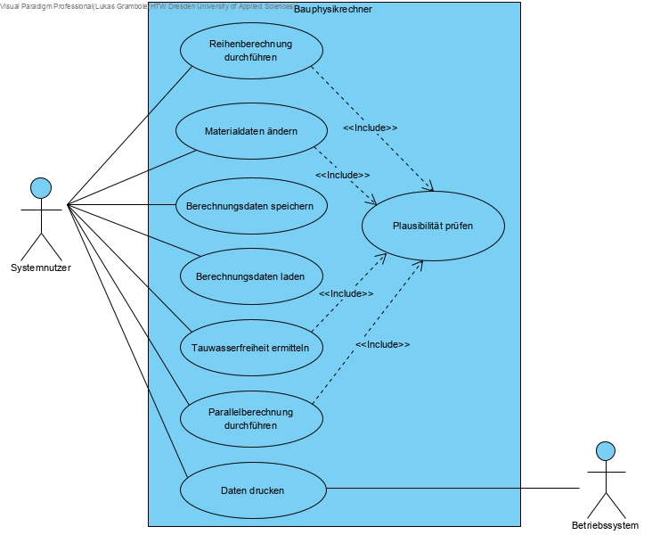

= Use-Case Model BauphysikSE1
Michael Daebler <michael.daebler@htw-dresden.de>; Lukas Grambole <lukas.grambole@htw-dresden.de>
0.5, 17.01.2019 
:toc: 
:toc-title: Inhaltsverzeichnis
:sectnums:
// Platzhalter für weitere Dokumenten-Attribute 

== Identifizierte Use Cases

[%header]
|===
|Kurzbezeichnung |Name|Akteur(e)| Beschreibung 
|UC1 |Reihenberechnung durchführen|Systemnutzer|Berechnung und Ausgabe von j, R~ges~, R~i~, R~T~, U, Δϑ~k~ und ϑ~k~ für in Reihe angeordnete Wandschichten
|UC2|Plausibilität prüfen|Systemnutzer|Überprüfung der Gültigkeit von Eingabedaten
|UC3 |Daten drucken|Systemnutzer, Betriebssystem|Druck auswählbarer Informationen
|UC4 |Materialdaten ändern |Systemnutzer|Änderung von Materialdaten
|UC5|Berechnungsdaten speichern|Systemnutzer|Speicherung von Eingabe- und Ergebnisdaten
|UC6|Berechnungsdaten laden|Systemnutzer|Laden von gespeicherten Eingabe- und Ergebnisdaten
|UC7 |Parallelberechnung durchführen|Systemnutzer| Berechnung und Ausgabe von j, R~ges~, R~i~, R~T~, U, Δϑ~k~ und ϑ~k~ für Bauteile mit parallelen Wandschichten
|UC8 |Tauwasserfreiheit ermitteln|Systemnutzer|Berechnung der Kondenswasserbildung an Bauteilen|
|===

== Use Case Diagramm

//Fügen Sie nachfolgend eine Liste aller Use-Cases per Include ein.
//Dafür sollten Sie pro Use-Case eine Datei anlegen, die auf dem usecase_spec.adoc Template basiert.

== Ausgearbeitete Use Cases

include::usecase_spec_Reihenberechnung_durchführen.adoc[]

include::usecase_spec_Plausibilität_prüfen.adoc[]

include::usecase_spec_Daten_drucken.adoc[]

include::usecase_spec_Materialdaten_ändern.adoc[]

