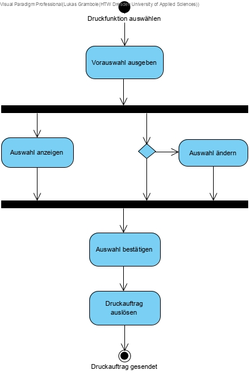
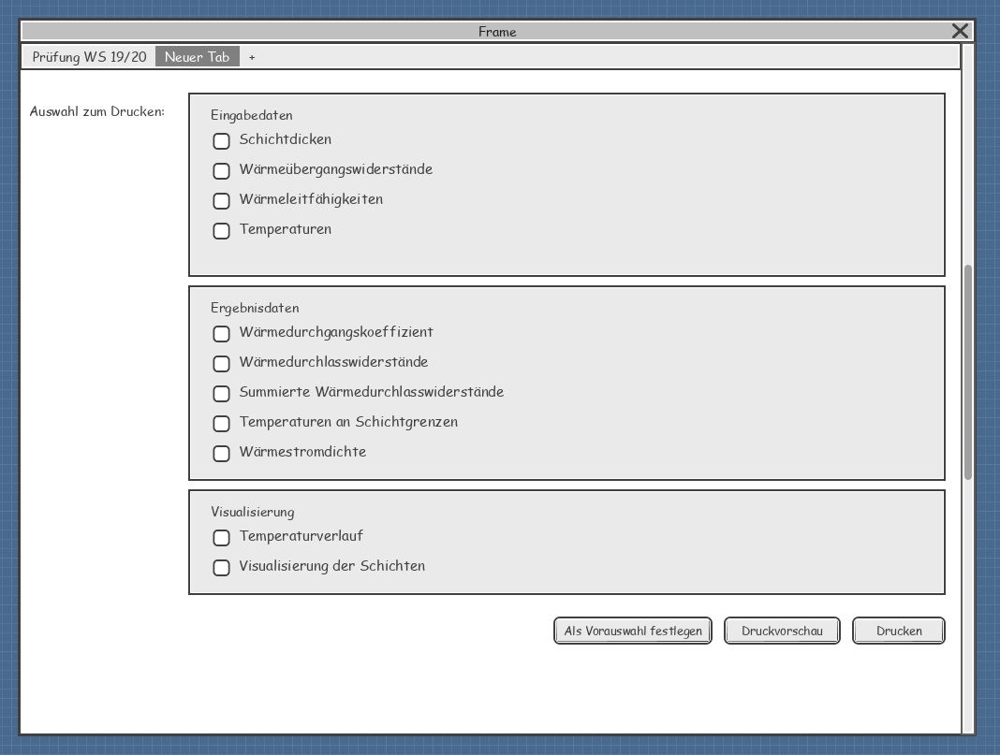

//Nutzen Sie dieses Template als Grundlage für die Spezifikation *einzelner* Use-Cases. Diese lassen sich dann per Include in das Use-Case Model Dokument einbinden (siehe Beispiel dort).
== Use Case: Daten drucken

=== Kurzbeschreibung
//<Kurze Beschreibung des Use Case>

Der Use Case beschreibt die Vorbereitung des Drucks von ausgewählten Daten.

=== Kurzbeschreibung der Akteure
*Systemnutzer*

will auswählbare Eingabedaten und Berechnungsergebnisse drucken.

=== Vorbedingungen
//Vorbedingungen müssen erfüllt, damit der Use Case beginnen kann, z.B. Benutzer ist angemeldet, Warenkorb ist nicht leer...
* Es liegen Berechnungsergebnisse vor.
* Es ist ein Drucker oder ein PDF-Drucker verfügbar.

=== Standardablauf (Basic Flow)
//Der Standardablauf definiert die Schritte für den Erfolgsfall ("Happy Path")

. Der Use Case beginnt, wenn der Systemnutzer die Druckfunktion auswählt.
. _WHILE_ Softwaresystem gibt eine Vorauswahl von Elementen für den Druck aus.
. _IF_ Systemnutzer möchte andere Elemente drucken
.. Der Systemnutzer ändert die Auswahl.
.. _IF_ Systemnutzer möchte ausgewählte Elemente als Standard für zukünftige Vorauswahl setzen
... Der Systemnutzer ordnet die Speicherung der getroffenen Auswahl als Standard an.
... Das Softwaresystem übernimmt die getroffene Auswahl als Standard für die Vorauswahl.
. Der Systemnutzer bestätigt die Auswahl
. Das Softwaresystem erstellt eine Druckvorschau.
. Der Systemnutzer löst den Druckauftrag aus.
. Das Softwaresystem sendet den Druckauftrag an das Betriebssystem.
. Der Use Case ist abgeschlossen.

=== Alternative Abläufe
//Nutzen Sie alternative Abläufe für Fehlerfälle, Ausnahmen und Erweiterungen zum Standardablauf
*Alternativer Ablauf #2

*Alternativer Ablauf 1*

Wenn der Systemnutzer im Schritt 4 des Standardablaufes keine Elemente für den Druck ausgewählt hat, dann

... Das Softwaresystem gibt eine Fehlermeldung aus.
... Der Systemnutzer bestätigt die Kenntnisnahme der Fehlermeldung.
... Der Standardablauf wird im Schritt 2 fortgesetzt. 

=== Wesentliche Szenarios
//Szenarios sind konkrete Instanzen eines Use Case, d.h. mit einem konkreten Akteur und einem konkreten Durchlauf der o.g. Flows. Szenarios können als Vorstufe für die Entwicklung von Flows und/oder zu deren Validierung verwendet werden.
* *SC1:* Der Systemnutzer wählt die Druckfunktion aus. Er bestätigt die Vorauswahl. Das System gibt eine Druckvorschau aus. Der Systemnutzer löst den Druckauftrag aus. Das Softwaresystem übermittelt den Druckauftrag an das Betriebssystem. Der Druckauftrag wurde erfolgreich erteilt.

* *SC2:* Der Systemnutzer wählt die Druckfunktion aus. Er möchte andere Elemente drucken und wählt anschließend kein Element für den Druck aus. Das Softwaresystem weist den Systemnutzer darauf hin, dass kein Element für den Druck ausgewählt wurde. Der Systemnutzer ändert seine Auswahl und fügt der Auswahl ein Element hinzu. Er bestätigt die Auswahl. Das System gibt eine Druckvorschau aus. Der Systemnutzer löst den Druckauftrag aus. Das Softwaresystem übermittelt den Druckauftrag an das Betriebssystem. Der Druckauftrag wurde erfolgreich erteilt.

=== Nachbedingungen
//Nachbedingungen beschreiben das Ergebnis des Use Case, z.B. einen bestimmten Systemzustand.
Bei erfolgreicher Durchführung des Use Case muss folgende Nachbdingung erfüllt sein:

* Der Druckauftrag wurde an das Betriebssystem gesendet.

=== Aktivitätsdiagramm

=== Wireframe
