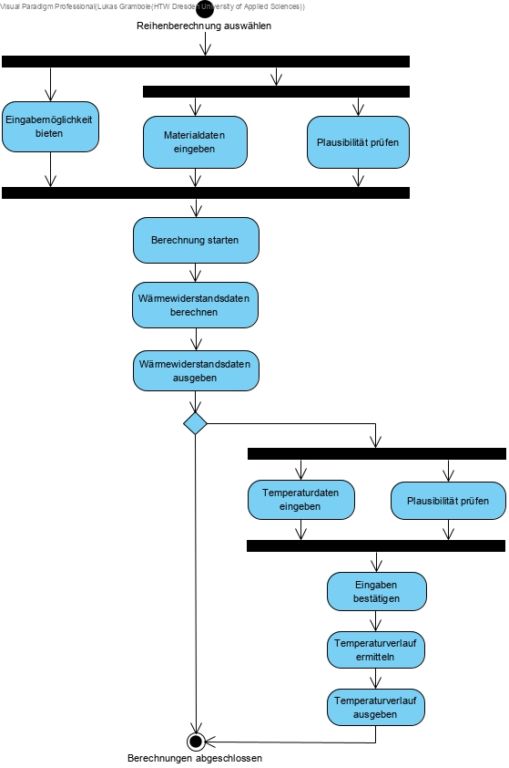
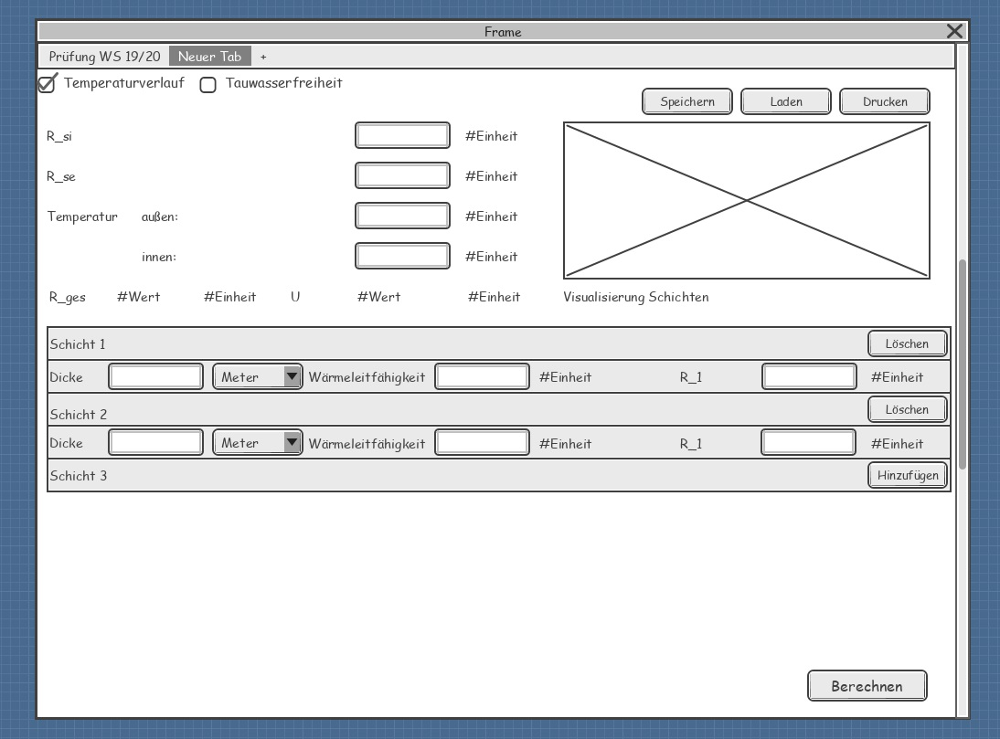

//Nutzen Sie dieses Template als Grundlage für die Spezifikation *einzelner* Use-Cases. Diese lassen sich dann per Include in das Use-Case Model Dokument einbinden (siehe Beispiel dort).

== Use Case: Berechnungen durchführen

=== Kurzbeschreibung

Der Use Case beschreibt einen Berechnungsvorgang für die Wärmewiderstandsdaten von in Reihe geschalteten Wandschichten.

=== Kurzbeschreibung der Akteure

*Systemnutzer*

will Wärmewiderstandsberechnungen durchführen.

==== Vorbedingungen
//Vorbedingungen müssen erfüllt, damit der Use Case beginnen kann, z.B. Benutzer ist angemeldet, Warenkorb ist nicht leer...
Der Systemnutzer hat das Softwaresystem gestartet.

==== Standardablauf (Basic Flow)
//Der Standardablauf definiert die Schritte für den Erfolgsfall ("Happy Path")

. Der Use Case beginnt, wenn der Systemnutzer die Funktion der Reihenberechnung ausgewählt hat.
. _WHILE_ Das System bietet eine Eingabemöglichkeit für die Materialdaten.
.. _WHILE_ Der Systemnutzer gibt die Materialdaten der Schichten ein.
... _INCLUDE_ Plausibilität prüfen
. Der Systemnutzer startet die Berechnung durch das Softwaresystem.
. Das Softwaresystem berechnet die Wärmewiderstandsdaten.
. Das Softwaresystem gibt die Wärmewiderstandsdaten aus.
. _IF_ Systemnutzer will einen Temperaturverlauf ermitteln
.. _WHILE_ Der Systemnutzer gibt Temperaturdaten ein.
... _INCLUDE_ Plausibilität prüfen
.. Der Systemnutzer bestätigt seine Eingaben.
.. Das Softwaresystem ermittelt den Temperaturverlauf.
.. Das Softwaresystem gibt den Temperaturverlauf aus.
. Der Use Case ist abgeschlossen.

==== Alternative Abläufe
//Nutzen Sie alternative Abläufe für Fehlerfälle, Ausnahmen und Erweiterungen zum Standardablauf

*Alternativer Ablauf #2.1*

Wenn der Systemnutzer im Schritt 2 des Standardablaufs vorgespeicherte Materialdaten verwenden möchte, dann

... Das Softwaresystem stellt dem Systemnutzer gespeicherte Materialdaten zur Verfügung.
... Der Systemnutzer wählt gespeicherte Materialdaten aus.
... Der Standardablauf wird im Schritt 2 des Standardablaufs fortgesetzt.

*Alternativer Ablauf #2.2*

Wenn der Systemnutzer im Schritt 2 des Standardablaufs weitere Materialschichten hinzufügen möchte, dann

... Der Systemnutzer fügt eine Schicht hinzu.
... Das System schafft Eingabemöglichkeiten für die Daten einer zusätzlichen Materialschicht.
... Der Standardablauf wird im Schritt 2 des Standardablaufs fortgesetzt.

*Alternativer Ablauf #2.3*

Wenn der Systemnutzer im Schritt 2 des Standardablaufs eine Materialschicht entfernen möchte, dann

... Der Systemnutzer entfernt eine Materialschicht.
... Das System entfernt die Eingabemöglichkeiten für die Daten einer Materialschicht.
... Der Standardablauf wird im Schritt 2 des Standardablaufs fortgesetzt.

*Alternativer Ablauf 3a*

Wenn der Systemnutzer im Schritt 3 des Standardablaufs berechnungsnotwendige Daten fehlen, dann

... Das Softwaresystem weist den Systemnutzer auf fehlende Daten hin.
... Der Systemnutzer bestätigt die Kenntnisnahme der Information des Softwaresystems.
... Der Standardablauf wird im Schritt 2 des Standardablaufs fortgesetzt.

==== Wesentliche Szenarios
//Szenarios sind konkrete Instanzen eines Use Case, d.h. mit einem konkreten Akteur und einem konkreten Durchlauf der o.g. Flows. Szenarios können als Vorstufe für die Entwicklung von Flows und/oder zu deren Validierung verwendet werden.
* *SC1:* Der Systemnutzer wählt die Funktion der Wärmewiderstandsberechnung aus und gibt die Materialdaten von zwei Schichten ein. Nachdem der Systemnutzer die Berechnung startet, berechnet das Softwaresystem die Wärmewiderstandsdaten und gibt diese aus. Die Berechnung wurde erfolgreich abgeschlossen.

* *SC2:* Der Systemnutzer wählt die Funktion der Wärmewiderstandsberechnung aus und gibt die Materialdaten von zwei Schichten ein. Nachdem der Systemnutzer die Berechnung startet, berechnet das Softwaresystem die Wärmewiderstandsdaten und gibt diese aus. Anschließend gibt der Systemnutzer Temperaturdaten ein und lässt einen Temperaturverlauf ermitteln. Die Berechnung wurde erfolgreich abgeschlossen.

* *SC3:* Der Systemnutzer wählt die Funktion der Wärmewiderstandsberechnung aus und wählt vorgespeicherte Materialdaten von zwei Schichten aus. Nachdem der Systemnutzer die Berechnung startet, berechnet das Softwaresystem die Wärmewiderstandsdaten und gibt diese aus. Die Berechnung wurde erfolgreich abgeschlossen.

* *SC4:* Der Systemnutzer wählt die Funktion der Wärmewiderstandsberechnung aus, fügt eine Schicht hinzu und gibt die Materialdaten von drei Schichten ein. Nachdem der Systemnutzer die Berechnung startet, berechnet das Softwaresystem die Wärmewiderstandsdaten und gibt diese aus. Die Berechnung wurde erfolgreich abgeschlossen.

* *SC5:* Der Systemnutzer wählt die Funktion der Wärmewiderstandsberechnung aus und gibt unvollständige Materialdaten von zwei Schichten ein. Nachdem der Systemnutzer die Berechnung startet, gibt das Softwaresystem eine Fehlermeldung aus. Der Systemnutzer ergänzt die fehlenden Daten und startet die Berechnung erneut. Dann berechnet das Softwaresystem die Wärmewiderstandsdaten und gibt diese aus. Die Berechnung wurde erfolgreich abgeschlossen.

// FÜR DEN TESTER: * *SC1:* Der Systemnutzer wählt die Funktion der Wärmewiderstandsberechnung aus und fügt zwei Schichten hinzu. Anschließend gibt der Systemnutzer die Eingabedaten d~1~ = 2 cm; d~2~ = 24 cm; d~3~ = 5 cm; d~4~ = 1 cm; λ~1~ = 0,35 W⋅m^-1^⋅K^-1^; λ~2~ = 0,56 W⋅m^-1^⋅K^-1^; λ~3~ = 0,045 W⋅m^-1^⋅K^-1^; λ~4~ = 0,7 W⋅m^-1^⋅K^-1; R~si~ = 0,13 m^2^⋅K⋅W^-1^ und R~se~ 0,04 m^2^⋅K⋅W^-1^ ein. Der Systemnutzer startet die Berechnung der Wärmedurchgangsdaten. Das Softwaresystem berechnet die Wärmewiderstandsdaten und gibt R~a~ = 0,0571 m^2^⋅K⋅W^-1^; R~b~ = 0,4286 m^2^⋅K⋅W^-1^; R~c~ = 1;1111 m^2^⋅K⋅W^-1^; R~d~ = 0,0143 m^2^⋅K⋅W^-1^; R~ges~ = 1,6111 m^2^⋅K⋅W^-1^; R~T~ = 1,7811 m^2^⋅K⋅W^-1^; U~W~ = 0,56 W⋅m^-2^⋅K^-1^ und j = 9,54 W⋅m^-2^ aus. Die Berechnung wurde erfolgreich abgeschlossen.

=== Nachbedingungen
//Nachbedingungen beschreiben das Ergebnis des Use Case, z.B. einen bestimmten Systemzustand.
Bei erfolgreicher Durchführung des Use Case muss folgende Nachbedingungen erfüllt sein:

* Die Berechnungsergebnisse werden ausgegeben. 

=== Aktivitätsdiagramm

=== Wireframes
image::wireframe_Reihenberechnung_durchführen1.jpg[]

