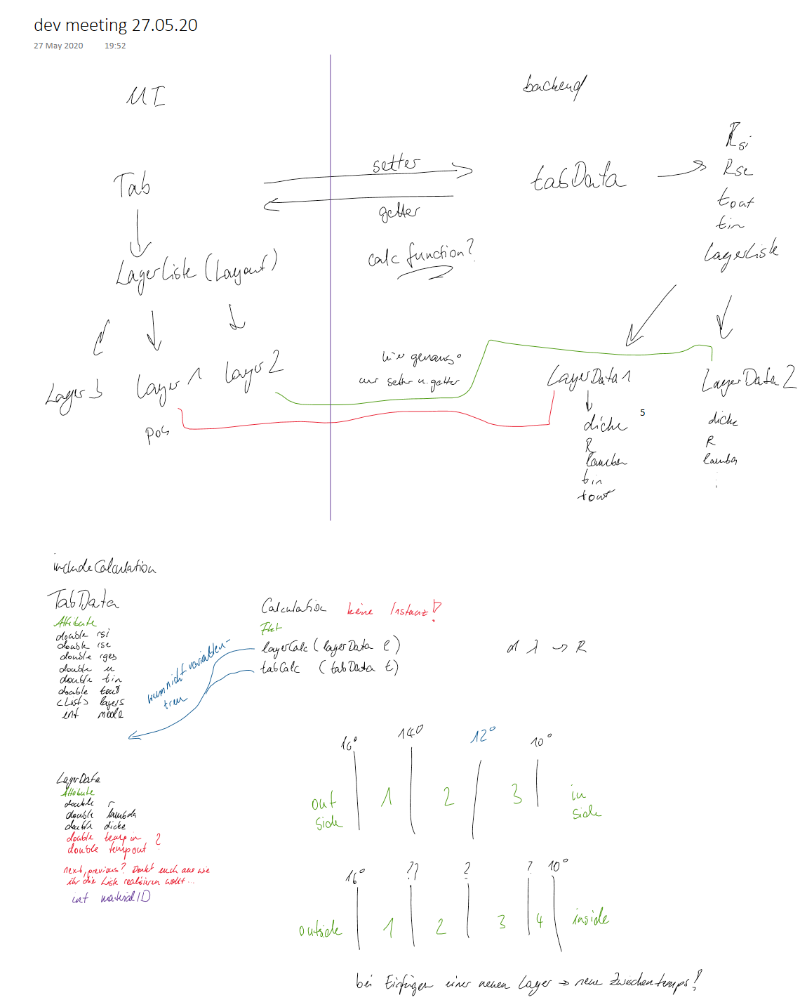

:doctype: book
:toc:
:toclevels: 3
:toc-title: Inhaltsverzeichnis
:sectnums:
:icons: font
:imagesdir: .
//:source-highlighter: highlightjs
:source-highlighter: rouge
:rouge-style: github
:xrefstyle: full
:experimental:
:chapter-label: 
:figure-caption: Abbildung
:table-caption: Tabelle
:listing-caption: Listing
:nofooter:

== Projektorganisation
 
=== Projektplan
 
==== Einführung

Wir als Team haben, im Rahmen der Lehrveranstaltung SE 2, ein Problem mithilfe eines Softwareproduktes lösen wollen. Für dieses Vorhaben mussten entsprechende Methoden, Modelle und Vorgehensweisen gefunden und richtig eingesetzt werden. 
Das Projekt wurde über 2 Semester, Wintersemester 19/20 und Sommersemester 20, bearbeitet. +
Im Folgenden Dokument werden Planung, Durchführung und Ergebnisse nachvollziehbar präsentiert werden. 

==== Aufgabenstellung und Ausganssituation

**Aufgabenstellung**

Im Folgenden wird die Aufgabenstellung vom ersten Semester zitiert:

**Hintergrund** +
Der Wärmedurchgangskoeffizient eines Bauteils U ist eine wichtige bauphysikalische Größe, welche
sowohl für die Ermittlung des Energiebedarfs eines Gebäudes als auch für den Nachweis des
Mindestwärmeschutzes und der Tauwasserfreiheit berechnet werden muss. Studierende des
Bauingenieurwesens führen derartige Berechnungen im Rahmen der Lehrveranstaltung Bauphysik aus.
Ein häufiger Anwendungsfall sind Wände aus mehreren parallelen Schichten (z. B. Innenputz/
Mauerwerk/Dämmmaterial/Außenputz). Um möglichst eine große Vielfalt an Aufgaben für die
Studierenden kreieren und die Lösungen überprüfen zu können, wird eine Software benötigt. Diese
Software ist zunächst nur für die Lehrenden gedacht, könnte aber zukünftig z. B. auch über OPAL für
die Studierenden bereitgestellt werden.

**Zielstellung** +
Entwickeln Sie für den beschriebenen Einsatz ein SW‐System, mit dem
1. die erforderlichen Daten zur Berechnung von U eingegeben werden können: die Wärmeübergangswiderstände,
die Anzahl der parallelen Schichten n, die Dicken und Wärmeleitfähigkeiten sowie
alternativ die Wärmedurchlasswiderstände i R der Materialien (bei komplexen Konstruktionen und bei
ruhenden Luftschichten),
2. die Berechnungen ausgeführt und
3. die Ergebnisse entsprechend der Gleichungen ausgegeben werden können.

**Ausgangssituation**

Im ersten Semester wurde das Projekt initialisiert,eine Anforderungsanalyse erarbeitet, auf eine technische Lösung geeinigt und das Projekt geplant. +
Die Anforderungsanalyse verlief sehr gut und die daraus gewonnenen Dokumente waren bereits in einem verfeinerten Zustand, wodurch hat das gesamte Team einen guten Eindruck des zu lösenden Problems hatte. +
Am Ende des ersten Semesters verließ ein Teammitglied, der Analyst, das Team. Aufgrund der Erfolgreichen Anfangs- und Ausarbeitungsphase haben wir uns entschieden die Rollenverteilung nicht zu ändern. +
Ziel des zweiten Semesters war die Konstruktions- und Übergangsphase erfolgreich Abzuschließen. Mithilfe der in der Vorlesungen kennengelernten Methoden strebten wir eine koordinierte und kooperative Konstruktion einer Softwarelösung an, die unsere Tests besteht und gleichzeitig möglichst alle Anforderungen der Kundin erfüllt. +
Dabei sollte, wie bereits schon in Software Engineering 1, mithilfe der Vorgehensweise OpenUP ein strukturierter Arbeitsablauf gewährleistet werden. +
Aufgrund der COVID-19 Pandemie wurden jegliche Präsenztermine wie Meetings oder Kundengespräche vorerst komplett Abgesagt und durch digitale Alternativen ersetzt.

==== Rahmenbedingungen +
*Das Team*
Die Tätigkeiten sind nach Rollen und Themengebiet aufgeteilt. Eine Person in Ihrer Rolle trägt Verantwortung in diesem Themenbereich und trifft hier nach eigenem Ermessen Entscheidungen. Alle anstehenden und abgeschlossenen Tätigkeiten werden flexibel in GitHub Issues festgehalten und soweit einer Iteration zugeordnet, bearbeitet. +
Die Rollenverteilung sieht wie folgt aus: +
[%header]
|===
|Name, Vorname |	Primäre Rolle|	Sekundäre Rolle
|Klassowski, Denis
|Project Manager
|Analyst
|Däbler, Michael
|Analyst
|Technical Writer
|Grambole, Lukas
|Analyst
|---
|Grieß, Christian
|Architect
|Developer
|Baburkin, Yewgenji
|Developer
|Project Manager
|Ullmann, Max
|Developer
|Tester
|Lehmann, Christian
|Tester
|Architect
|Fritzsche, Felix
|Deployment Eng
|Developer

|===

*Bearbeitungszeitraum* +
Der Bearbeitungszeitraum des Problems beträgt in etwa 7 Monate. Aufgrund der agilen Entwicklung ist die Übergabe der Softwarelösung mit dem 31.07.2020 festgeschrieben. +
*Ressourcen* +
Alle Teammitglieder des zweiten Semesters sind Studenten in Informatischen Studiengängen und teilnehmer im Modul Software Engineering 2. Damit ist ein Verständnis von Informatischen Systemen gegeben und die Vorgehensweise OpenUP bekannt. 
Desweiteren besitzt jedes Mitglied einen Rechner mit Mikrofon und kann somit an digitalen Meetings teilnehmen. +

Für Modellierung kann, im Rahmen der Lehrveranstaltung, das Programm Paradigm™ genutzt werden. +

Als Versionsverwaltung der Software wird das Online Tool GitHub verwendet. +

*Kommunikation* +

Die Kommunikation innerhalb des Teams verläuft über 3 Kanäle. +

. *GitHub* Issues +

. *Discord* (Onlinedienst für Instant Messaging, Chat und Sprachkonferenz)

. *WhatsApp* (Instant Messenger)

Die Kanäle haben dabei eine klare Zuordnung von Aufgabenfeldern. +

*GitHub* Issues dient als Work-Item-List und sofortiges Feedback zu Pushes oder Lösungen. +
*Discord* wird für Meetings jeglicher Art genutzt. (Iteration Meeting, Kleingruppen Meetings Kundengespräche, Pair Programming). +
*WhatsApp* Vereinbarung von Meetings und Instant Feedback bei Problemen

Für die Kommunikation mit dem Kunden haben wir uns darauf geeinigt das Meeting in Discord abzuhalten. Dafür wurde das Programm per Telefonie im Vorfeld eingerichtet und die Nutzung erläutert.

**Dokumentation** +

Die Dokumentation wurde in größtenteils in GitHub geführt, teilweise jedoch auf Google Docs ausgelagert. Dadurch konnten einige Dokumente einfacher gepflegt und auf dem aktuellen Stand gehalten werden. +
Bei der Dokumentation haben wir uns an das Vorgehensmodell OpenUP gehalten. +

==== Eingesetzte Techniken

Pair Programming +
Code Review +

=== Durchführung +

Im Folgenden sind, in chronologischer Reihenfolge, die Ziele, Aktivitäten, Ergebnisse und Entscheidungen Stichpunktartig aufgelistet. 2.x Steht für Iteration x im zweiten Semester. +

==== Iteration 2.1
Start: 30.03.2020 +
Ende: 12.04.2020

*Ziele*:

* Projekt wieder anschieben
* Auf die Corona Situation anpassen und besprochene
* Alternativen nutzen
* Implementierung von GitHub Issues als Work Item List
* Vorbereiten auf Kundengespräch
* Haupt Prototyp wird erstellt und iterativ angepasst

*Aktivitäten*:

* Iterations Meeting
* Einrichtung eines Discord Servers
* Struktur und Richtlinie für GitHub Probleme festgelegt

*Ergebnisse*:

* Eigenständige Organisation von Rollen Meetings funktioniert gut
* Sammlung einiger ungeklärter Fragen an Kunden
* Team ist trotz des verzögerten starts zuversichtlich
* Teammoral ist sehr positiv und motiviert

*Entscheidungen*:

* Die wegfallende Rolle des Analysten wird nicht neu besetzt

** Ein Analyst reicht für das Projekt aus 

* Developer sind unterteilt in frontend und backend

** Devs müssen nicht immer wieder einarbeiten in Quellcode

* Meetings werden künftig in Discord abgehalten 
** Ist ein umfangreiches und zugleich kostenloses Tool

* Es wird, bis auf weiteres, keine Präsenz Meetings geben 

** Gesetzgebung lässt es nicht zu und das Infektionsrisiko soll klein gehalten werden

*Probleme*:

* Meetings haben spät begonnen 
** Die Idee eine Iteration kürzer zu machen wurde verworfen. Wir glauben immer noch gut in der Zeit zu liegen
* Dokumentation ist umständlich
** Die Dokumentation wird etwas aufgeteilt und teils in Google Drive gespeichert

==== Iteration 2.2
Start: 13.04.2020 +
Ende: 27.04.2020 +

*Ziele*:

* Prototyp weiterentwickeln damit eine Präsentation an den Kunden möglich ist
* Meetings strukturierter abhalten
* Kundenmeeting planen

*Aktivitäten*:

* Iterations Meeting
* Haupt Prototyp wurde erstellt und entspricht bereits grob dem Wireframe
* Noch offene Fragen an den Kunden wurden gesammelt und mit Anforderungen gegengeprüft
* Meeting Protokoll aus 2.1 wurde überarbeitet
* Dev-Meeting für die exakte zuordnung von Aufgaben
* Kundenmeeting geplant und vorbereitet

*Entscheidungen*:

* Kürzeres Feedback Intervall durch Devs in dieser Iteration
** Damit Fertigstellung bis Kundenmeeting sichergestellt ist
* Alle Mitglieder sind für GitHub Issues verantwortlich und müssen darauf achten, dass die festgelegten Richtlinien von allen eingehalten werden
** Es entsteht sonst Undurchsichtigkeit und Aufwand

*Probleme*:

* Haupt Prototyp ist noch nicht ausreichend für ein Kundenmeeting
** Rückmeldung der Devs nach einer Woche, sollte die Velocity nicht ausreichen ➝ Zuordnung von mehr Ressourcen  
* Aufgabenzuordnung schwierig da in dieser Iteration nicht viele Aufgaben existierten
** Keine Künstlich geschaffenen Probleme generieren um Aufgabengestaltung fairer zu machen. Wurde im Meeting besprochen, alle haben dem Umgang zugestimmt
* Backend Entwicklung kann nicht nicht erfolgen da Objektmanagement innerhalb des Programms noch unklar ist. Es bedarf noch mehr Einarbeitung in Qt5
** Backend Devs sollen sich mit Qt5 beschäftigen um ein Verständnis für das Framework zu entwickeln

==== Iteration 2.3
Start: 27.04.2020 +
Ende: 10.05.2020 +

*Ziele*: +

* Backend entwicklung planen
* Datenstruktur fertigstellen
* U-Berechnung fertigstellen
* Feedback der Kundin mit höchster Priorität verarbeiten
* Prototyp zum Druckauftrag erstellen
* Testskripte für U-Berechnung schreiben
* Code Review vereinbaren (Frontend)
* Risk List überarbeiten
* Erstes Dokument zu Programmbedienung erstellen
* Prototyp in logischer Programmierung erstellen (dynamisches Berechnen)
* Branching einführen
* Analyse der neuen Informationen vom Kunden (mehr Beispielaufgaben) auf mehrwert

*Aktivitäten*:+

* Iterations Meeting
* Discord beim Kunden eingerichtet
* Kundenfeedback in Anforderungen übernommen
* Kundenmeeting abgehalten
* Datenstruktur wurde bearbeitet
* Frontend angepasst 
* Farbdesign entworfen

*Entscheidungen*: +

* Dev meeting am Ende der Woche um fertigstellung von Backend zu gewährleisten
** Backend jetzt von hoher Prioriät weil weitere Tests auf Berechnungen unvollständig sind
* (Vorläufige Entscheidung) Logische Programmierung kommt nicht zum Einsatz weil der Aufwand sehr hoch ist und die Anforderung optional

*Probleme*:

* Frontend hat keinen guten Eindruck hinterlassen weil es nicht ansprechend genug war
** Beim Endkunden Meeting (besonders bei der Vorstellung von Produkt Oberfläche) hätten wir Farben und Design einfließen lassen sollen und nicht nur die Anordnung/Existenz von Button bzw. Interaktionsfelder

==== Iteration 2.4
Start: 11.05.2020 +
Ende: 25.05.2020 +

*Ziele*: +

* Berechnungen fertigstellen
* Berechnungen testen
* Import / Export hinzufügen
* Import / Export testen
* Druckauftrag bearbeiten
* Die wichtigsten Anforderungen erfüllen um das Programm demnächst an Kunden zu übergeben (Betaphase)
* Backend testen

*Aktivitäten*: +

* Iterations Meeting
* Frontend wurde an neues Design angepasst
* Alle bisherigen Frontend Issues bearbeitet
* Deployment Plan aktualisiert
* Tests wurden vorbereitet
* Design mit Icons vervollständigt
* Code Review abgehalten

*Entscheidungen*:

* Das Backend wird nun von Ersatzrolle Dev und Tester erstellt
** Backend Dev sagte er habe wenig Zeit, würde es aber bis Iterationsende fertigstellen. Dann meldete er sich nicht ➝ Neuzuteilung
* Logische Programmierung wird endgültig verworfen
** Logische Programmierung ist auch am zweiten Versuch als Sinnvolle Lösung gescheitert

*Probleme*: +

* Backend Dev hat wenig Zeit 
** Seine Aufgaben werden nun auf die anderen Mitglieder verteilt
* Einige Ziele der Letzten Iteration wurden nicht erreicht
** Verschiebung in der Priorität

==== Iteration 2.5 
Start: 26.05.2020 +
Ende: 16.06.2020 +

*Ziele*:

* Druckauftrag fertigstellen
* Kundenfeedback aus Betaphase umsetzen
* Neudesign der Startoberfläche
* Persistente Speicherung fertigstellen
* Dev Meeting planen
* Flyer und benutzerhandbuch aktualisieren
* Zweite Betaversion an Kunden übergeben

*Aktivitäten*:

* Iterations Meeting
* Erstes Deployment von Betaversion des Programms
* Dev Meeting abgehalten
* Kundenfeedback aus Beta in Anforderungen aufnehmen

*Entscheidungen*:

* Neue Betaversion wird an Kunden übergeben
** Einige, sehr wichtige, Funktionen fehlen noch in der ersten Version

*Probleme*:

* Backend Dev weiterhin verhindert
** Erstmal keine unmittelbare wichtige Aufgaben zugeordnet
* Nur wenige Teammitglieder sind in der Lage Programmcode zu schreiben
** Verschieben mehrerer Tätigkeiten, sodass Devs zu Verfügung stehen
** Code Review hat dieses Problem nicht verhindern können

==== Iteration 2.6 
Start: 16.06.2020 +
Ende: 29.06.2020 +

*Ziele*:
* Neudesign der Startoberfläche diese Iteration lösen
* Optionale Anforderungen und Quality of Life Features hinzufügen
* Verbesserungsvorschläge des Teams evaluieren
* Auf Kundenfeedback reagieren und Dokumente anpassen
* Kleine Optische veränderungen um dem Design zu entsprechen
* Bugfixing(Druckauftrag, Zahlendarstellung, Graph Skalierung)

*Aktivitäten*:

* Iterations Meeting

*Entscheidungen*:

* Einige Optionale Anforderungen die wenig Gewichtung für den Kunden haben werden verworfen
** Kunde hat auch bei einer erneuten Rücksprache nur wenig Interesse an diesen Änderungen gezeigt

*Probleme*:

* Kommunikation zu Backend Dev ist nur schwierig aufzubauen
** Mittlerweile ist die Dev Rolle bereits vergeben. Zuordnung von kleineren Aufgaben (CSS Anpassungen)

==== Iteration 2.7 
Start: 29.06.2020 +
Ende: 12.07.2020 +

*Ziel*:

* Fehlende CSS Anpassungen neu verteilen
* letzte Testfehler bearbeiten
* Dokumentation für Belegabgabe vorbereiten
* Finale Übergabe des Programms

*Aktivitäten*:

* Iterations Meeting

*Entscheidungen*:

* Alle anderen Bearbeitungen erfolgen nach der Prüfung
** Software so gut wie fertig und alle Mitglieder sind jetzt in Prüfungsstress

*Probleme*:

* Backend Dev meldet sich nicht mehr und nimmt nicht an Meetings teil
** Projekt bereits so gut wie abgeschlossen. Keine Gefahr mehr für Teamerfolg

==== Geprächsprotokoll 1

*Anwesend*
. Tester
. Manager
. Analyst
. Dev (Yewgenij)
. Deployment
. Kunde

*Ziel des Meetings: Erklärung und Vorstellung des Prototypen / Feedback zu bisherigem Stand*

*Das wurde dem Kunden erklärt:*
. Tab System
. Wo sind die Eingabemöglichkeiten
. Überblick zum Schichtsystem (dynamisches einfügen und löschen)
. Schichtemperatursystem 
. Fuktion des Moduswechsels
. Erhalt der Werte bei Moduswechsel
. Verlauf des Projektes und die Zielstellung einen Prototypen zu bauen der an den Kunden übergeben wird

*Bemerkung des Kunden:*
- Bezeichnung "Breite" ändern zu "Dicke"
- Zweiteilung der Eingabemaske und Schichtsystem deutlich machen
- U Wert Berechnung bei Temp Berechnung nicht notwendig
- Werte sollen bei wechsel zu Temp Modus erhalten bleiben
- Wichtige Werte bei Temp Berechnung sollen angezeigt werden: Rsi,Rse,U - Wert, Rt, R Gesamt
- im Formlayout R{Nummer} statt Ri schreiben (Reihenfolge)
- Programm soll entwas Farblicher und ansprechender sein

*Fragen an den Kunden*
. Soll eine Fehleingabe durch ein Popup signalisiert werden?
- Nein, Fehleingabe unterdrücken reicht aus.
. Wie sollen die einzelnen Tabs gespeichert werden? 
- Ein Tab (eine Berechnung) wird unter einem Namen als Datei gespeichert
. Welches Layout soll der Druckauftrag einer Berechnung haben
- Soll ähnlich aussehen wie das Layout im Programm, Mehrere Tabellen mit Materialdaten/Eingangsdaten/Allgemeine Daten/ Grenzwerttabelle 
- Kunde wird noch eine Beispieltabelle als Vorlage anlegen
. Soll das Programm rekursive Berechnung (Fehlender Parameter wird errechnet) bieten?
- Wäre gut aber hat keine Priorität

*Fazit*
- Kunde ist Grundsätzlich zufrieden, Anmerkungen waren überwiegend visuelle Wünsche
- Es ist davon auszugehen das unsere Vorstellung des Prototypen das Problem des Kunden lösen kann

==== Gesprächsprotokoll 2

Iterations Meeting am  10.05.2020 +
Beginn 16:00 +
Fehlende Teilnehmer: Max Ullmann +
*Was haben wir erreicht?* + 

* Alle Issues wurden behandelt, Datenstruktur und Funktionen sind hochgeladen +
* Testskripte / testlogging sind geschrieben +
* Farbliche Idee entworfen +
* Benutzerhandbuch angefangen +

*Welche Probleme hab es?* +

* Problem in Datenstruktur, Objektgestaltung von Export unklar +
* Windows 10 findet executable file unsicher +
* Backend Dev weiterhin verhindert, zuarbeit wird jedoch benötigt +
* Meeting musste verschoben werden [10.05 -> 19.05] +

*Was sind unsere Ziele für die nächste Iteration* +

* Entscheidung ob logische Programmierung verwendet wird +
* Coach Meeting planen? +
* Berechnung fertigstellen und testen +
* Erklärung der GUI im Handbuch +

==== Gesprächsprotokoll 3

Iterations Meeting am 30.03.2020 +
Beginn: 16:00 +
Fehlende Teilnehmer: - +

*Was waren die Probleme in SE1?* +

* chaotische Abarbeitung der Aufgaben. Gesamtübersicht hat gefehlt
* Lösung durch GitHub Issues

*Ideen für weitere Verbesserungen?*

* Keine weiteren Vorschläge
* Gemeinsame Besprechung und Entscheidung das Discord sinnvolle, zentrale Kommunikationseinheit ist
* Gemeinsame Besprechung und erörterung wie GitHub Issues aussehen sollen

*Wie soll die Entwicklung ablaufen?*

* Architekt überblickt Gesamtsystem und verteilt requirements als Issue an Devs
* Dev entwickelt Prototyp, welcher durch Tester geprüft wird
** Ist der Test ok wird der Prototyp in Gesamtsystem integriert

*Sonstige*

* Team war mit Iterationsdauer zufrieden.
* Zwei Wochen Rhythmus bleibt auch für SE2 bestehen
* Jedes Mitglied kann trotz der Pandemie am Projekt arbeiten
* Teammoral ist sehr Positiv

==== Gesprächsprotokoll 4

Iterations Meeting am 12.07.20 +
Beginn: 16:00 +
Fehlende Teilnehmer: Max Ullmann, Christian Grieß, Christian Lehmann +
*Was haben wir erreicht?*

* Fast alle Tests sind erfolgreich gewesen
* Anforderungsanalyse angepasst

*Welche Probleme gab es?*

* Das HTML Dokument und der PNG Export des pyqtgraph sind noch nicht flexibel einsetzbar. Funktioniert nur bedingt
* Max hat sich immer noch nicht gemeldet und auch die CSS wird langsam benötigt

*Was wollen wir nächste Iteration erreichen?*

* Dokumentation für Beleg machen
* Produkt Übergeben
* Projekt abschließen
* Finale Änderungen in den Dokumenten

include::UseCase/usecase_model.adoc[lines=1..1;4..-1,leveloffset=+1]

== Anwenderdokumentation

=== Benutzerhandbuch

link:https://github.com/fowado/BauphysikSE1/blob/master/Benutzerhandbuch.pdf[Benutzerhandbuch]

=== Flyer

link:https://github.com/fowado/BauphysikSE1/blob/master/Flyer.pdf[Flyer]

== Entwicklerdokumentation 
=== Entwurfdokumentation
Yewgenij Baburkin <yewgenij.baburkin@htw-dresden.de>
1.0, 14.08.2020 

==== Systemarchitektur

.Grobe Entwurfsskizze

In einem Dev-Meeting kam die obere, durchaus informelle Skizze zustande. Ziel dieser war die Struktur der Klassen sowie deren Anordnung festzuhalten. Zu sehen ist, dass in einem Tab eine Liste von Layern geführt wird, genauer genommen im Layout des Bereichs des Tabs, in welchen Layer(Widgets) eingefügt werden. Jede Layer hat hierbei ein zugehöriges LayerData Objekt, welches die Informationen einer Layer beinhaltet. Jeder Tab besitzt ein tabData Objekt, welches alle zur Berechnung und Speicherung notwendigen Informationen beinhaltet. In diesem wird auch eine Liste geführt, welche LayerData Objekte verwaltet. Die Berechnung sollte ausgelagert werden, jedoch nicht instanziiert. Je nach dem, wie variablentreu (pass by value oder pass by reference) Python ist, sollte darüber nachgedacht werden, wie man diese Berechnungsfunktionen inkludiert.

.UML-Class Diagram
image::class.svg[class]

Dies ist die aktuelle Ansicht der benutzten Klassenstruktur. Zu erkennen ist, dass der vorherige Entwurf dementsprechend umgesetzt wurde. Kleinere Klassen sind hinzugekommen (z.B. MyDoubleSpinBox), welche jedoch einfach nur von denentsprechenden QT-Klassen abgeleitet wurden und deren Verhalten in bestimmten Situationen angepasst wurde.

.Package Diagram
image::package.svg[package]

In dieser Grafik kann man das Zusammenspiel zwischen den verschiedenen packages erkennen. Hierbei ist zu bemerken, dass `\__init__` eingentlich `mainwindow.py` ist, jedoch im Rahmen der Generierung des Diagramms umbenannt werden musste.

==== Verwendete Frameworks/Module

* PyQt5
* numpy
* pyqtgraph

==== Struktur der gespeicherten Dateien

.Tab-Struktur
|===
|Stelle|Einheit|Bezeichnung

|name|String|Name des Tabs
|rright|double|R-Wert rechts (siehe TabData doc)
|rleft|double|R-Wert links (siehe TabData doc)
|rsum|double|Summe R-Werte aller Layer
|tright|double|Temperatur rechts (siehe TabData doc)
|tleft|double|Temperatur links (siehe TabData doc)
|mode|int|Modus, in welchem sich der Tab befindet
|u|double|Rt invertiert
|rt|double|Summe Rges und umgebende R-Werte
|layers|"Liste"|Die einzelnen Layers

|===

.Layer-Struktur
|===
|Stelle|Einheit|Bezeichnung

|1|double|Dicke der Schicht
|2|int|Einheit der Dicke (0: m, 1: cm, 2: mm)
|3|double|Lambda-Wert
|4|double|R-Wert
|5|double|linke Außentemperatur der Schicht
|6|double|rechte Außentemperatur der Schicht
|7|double|Rho-Wert der Schicht
|8|int|Material-ID
|9|String|Name der Schicht

|===

.Beispiel einer gespeicherten Datei
image::beispiel.png[Beispiel]

==== Sequenzdiagramm

Da hier keine Client-Server oder Microservice o.Ä. Architektur vorliegt, wurde sich dazu entschieden, ein Sequenzdiagramm *nicht* anzufertigen. Es ergibt in Bezug auf den Aufwand keinen Mehrwert. Welche Klasse was aufruft, kann man auch dem UML-Klassendiagramm entnehmen.

==== Schnittstellen

None. Es handelt sich um eine Standalone-Anwendung mit keiner Aussicht auf Integration in andere Gebiete/Anwendungen.

== Betriebsdokumentation

=== Systemvorraussetzungen

* *Mindestanforderungen*
** handelsüblicher Rechner + Komponenten ( Maus, Tastatur)
** Prozessor mit 1 GHz (oder schneller) oder ein SoC-System 
** RAM: 1 GB für 32 Bit oder 2 GB für 64 Bit 
** Festplattenspeicher: 16 GB für 32-Bit-Betriebssystem oder 32 GB für 64-Bit-Betriebssystem 
** Grafikkarte: DirectX 9 oder höher mit WDDM 1.0 Treiber 
** Display: 800 x 600

* *Softwareanforderungen*
** Windows 10
** Mindestens Python 3.8

=== Systemeinrichtung
*Komponente*
* .exe /
* .dll / 
* .dist /
* .pyc /
* .py

* *Installation* 
 ** Es ist keine Installation notwendig, die Kundin führt eine Executable (.exe) aus. Das Executable wird der Kundin als Download über den HTW-Cloudspeicherplatz (Owncloud) zur Verfügung gestellt. Dafür wird auf dem Cloudspeicherplatz des Teammanagers (Denis Klassowski) ein neuer Ordner angelegt, in dem das aktuelle Release der Software liegt.

* *Sonstige Bestandteile*
** Kein Passwortschutz 
   (eventuell für den Download-Ordner )
** Ein  Internetzugang wird nur für den Download benötigt, für die Nutzung ist keine   
   Netzanbindung notwendig.

=== Systembetreuung 

* *FAQ* 
** Sie haben Fragen an das Programm? -> Sie können sich an Denis Klassowski (denis.klassowski@htw-dresden.de) wenden.
** Was soll ich tun, wenn das Programm nicht oder fehlerhaft startet?
-> Datein erneut und vollständig herunterladen & überprüfen ob alle notwendigen Files im Verzeichnis liegen.
** Wo sind meine Datein gespeichert? -> Alle gespeicherten Datein werden als .baup in das gewünschte Verzeichnis gespeichert. Zum Aufruf der Datei, öffnen Sie das Programm und öffnen Sie Ihre .baup Datei.
** Was soll ich tun, wenn meine .baup nicht lädt -> Wohlmöglich, ist Ihre Datei fehlerhaft, Sie können Ihre Datei als .txt öffnen und manuell Änderungen vornehmen.

* *Datensicherung und Datenwiederherstellung*
** Sie können Ihre Berechnungen speichern und  zu einen späteren Zeitpunkt wieder aufrufen
** Bei einem Programmabsturz, werden sämtliche nicht gespeicherte Eingangsdaten gelöscht 

= 7. Testdokumentation
include::Test/Testkonzept.adoc[lines=1..1;4..-1,leveloffset=+1]
include::Test/TestLog.adoc[lines=1..1;4..-1,leveloffset=+1]